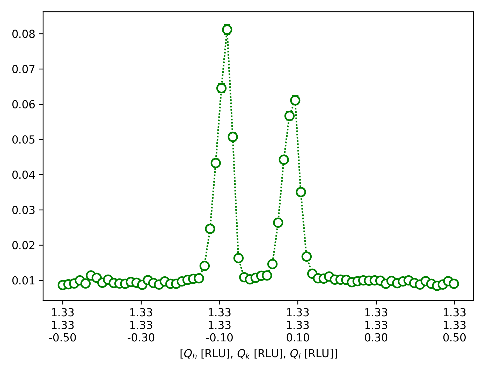

Cut1D
^^^^^
After inspecting the scattering plane, we want to perform cuts along certain directions. In this tutorial, we demonstrate the cut1D function. Cuts can be made given by hkl or Qx, Qy, Qz. The width of the cut can be adjusted by the keywords width and widthZ. Note that this function is not intended for obtaining integrated intensities of Bragg peaks.

.. code-block:: python
   :linenos:

   import matplotlib.pyplot as plt
   from DMCpy import DataSet,DataFile,_tools
   import numpy as np
   import os
   
   #file = r'Path\To\Data\Folder\dmc2021n009003.hdf'
   
   # Give file number and folder the file is stored in.
   scanNumbers = '8540' 
   folder = 'data/SC'
   path = os.path.join(os.getcwd(),folder)
   year = 2022
      
   # Create complete filepath
   file = os.path.join(os.getcwd(),_tools.fileListGenerator(scanNumbers,folder,year=year)[0]) 
   
   # Load data file with corrected twoTheta
   df = DataFile.loadDataFile(file)
   
   # Use above data file in data set. Must be inserted as a list
   ds = DataSet.DataSet([df])
   
   # load UB matrix
   ds.loadSample(r'data/SC/UB.bin')
   
   # Here we do a cut over the (440) reflection by the cut1D function. 
   # cut1D takes start and end point as lists.
   
   kwargs = {
             'width' : 0.2,
             'widthZ' : 0.2,
             'stepSize' : 0.005,
             'rlu' : True,
             'optimize' : False,
             'marker' : 'o',
             'color' : 'green',
             'markersize' : 8,
             'mew' : 1.5,
             'linewidth' : 1.5,
             'capsize' : 3,
             'linestyle' : (0, (1, 1)),
             'mfc' : 'white',
             }
   
   positionVector,I,err,ax = ds.plotCut1D([0.975,0.975,0],[1.075,1.075,0],**kwargs)
   fig = ax.get_figure()
   fig.savefig('figure0.png',format='png')
   
   #export of cut to text file
   saveData = np.column_stack([positionVector[0],positionVector[1],positionVector[2],I,err])
   np.savetxt(os.path.join(path,'cut.txt'),saveData,header='h,k,l,I,err',delimiter=',')
   

The above code takes the data from the A3 scan file dmc2021n008540, and align it by a UB matrix loaded from disk.Then one cuts across the 110 relection is performed. The example also demonstrate how kwargs can be given to the functions to adjust the apperance of the figure. 

The cut is diplayed below 

 