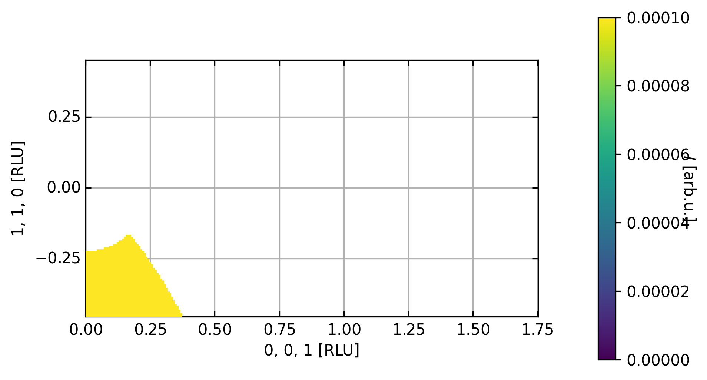

Cut2D
^^^^^
After inspecting the scattering plane, we want to perform cuts along certain directions. In this tutorial, we demonstrate the cut2D function. Cuts can be made given by hkl or Qx, Qy, Qz. The width of the cut orthogonal to the plane can be adjusted by the keywords width and width. The grid the cut is projected on is given by the xBins and yBins keywords.

.. code-block:: python
   :linenos:

   import matplotlib.pyplot as plt
   from DMCpy import DataSet,DataFile,_tools
   import numpy as np
   import os, copy
   
   # Give file number and folder the file is stored in.
   scanNumbers = '8540' 
   folder = 'data/SC'
   year = 2022
      
   # Create complete filepath
   file = os.path.join(os.getcwd(),_tools.fileListGenerator(scanNumbers,folder,year=year)[0]) 
   
   # Load data file with corrected twoTheta
   df = DataFile.loadDataFile(file)
   
   # Use above data file in data set. Must be inserted as a list
   ds = DataSet.DataSet([df])
   
   # load UB matrix
   ds.loadSample(r'data/SC/UB.bin')
   
   # define 2D cut width orthogonal to cut plane
   width = 0.5
   step = 0.01
   
   points = np.array([[0.0,0.0,0.0],
         [0.0,0.0,1.0],
         [1.0,1.0,0.0]])
      
   xstart = -np.linalg.norm(ds[0].sample.calculateHKLToQxQyQz(0,0,0))
   xend = np.linalg.norm(ds[0].sample.calculateHKLToQxQyQz(2*1.5,-1*1.5,0))
   ystart = -np.linalg.norm(ds[0].sample.calculateHKLToQxQyQz(0,0,0.5))
   yend = np.linalg.norm(ds[0].sample.calculateHKLToQxQyQz(0,0,0.5))
   
   kwargs = {
      'xBins' : np.arange(xstart,xend,step),
      'yBins' : np.arange(ystart,yend,step),
      'steps' : 151,
      'rlu' : True,
      'rmcFile' : True,
      'colorbar' : True,
      }
   
   ax,returndata,bins = ds.plotQPlane(points=points,width=width,**kwargs)
   
   ax.set_clim(0,0.0001)
   ax.set_xticks_base(0.25)
   ax.set_yticks_base(0.25)
     
   planeFigName = 'docs/Tutorials/2Dcut'
   plt.savefig('figure0.png',format='png')
   
   kwargs = {
      'rmcFileName' : planeFigName+'.txt'
      }
   
   ax.to_csv(planeFigName+'.csv',**kwargs)
   

The above code takes the data from the A3 scan file dmc2021n000590, align and plot the scattering plane.

Figure of the 2D plane in RLU. 

 