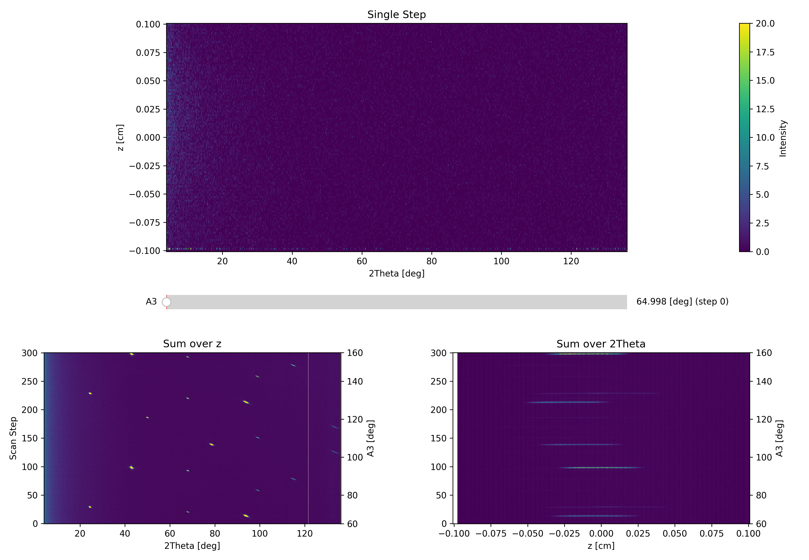
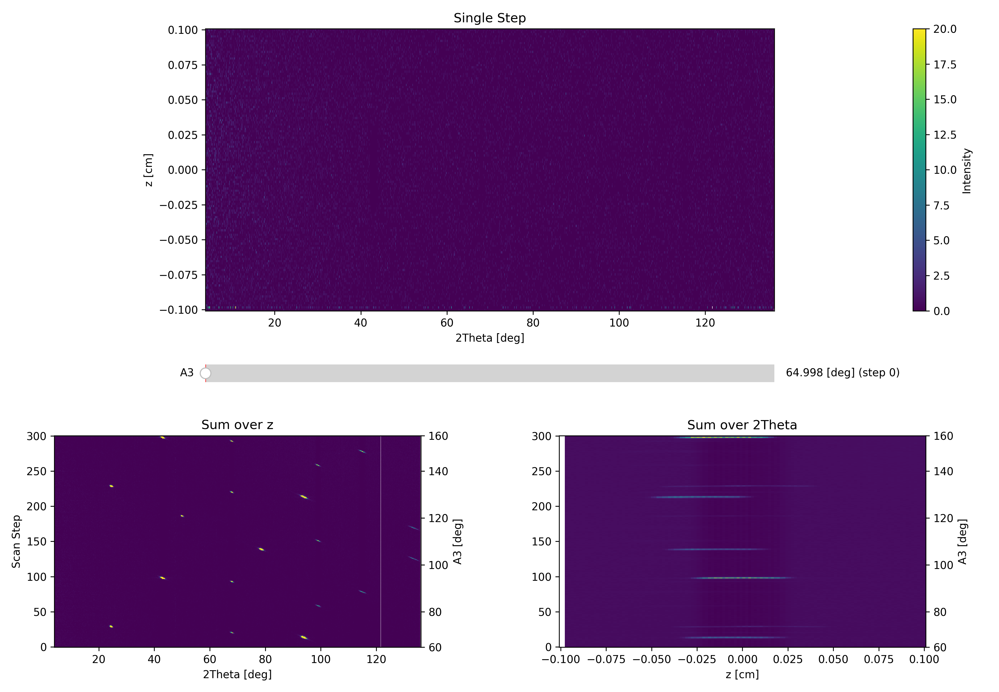
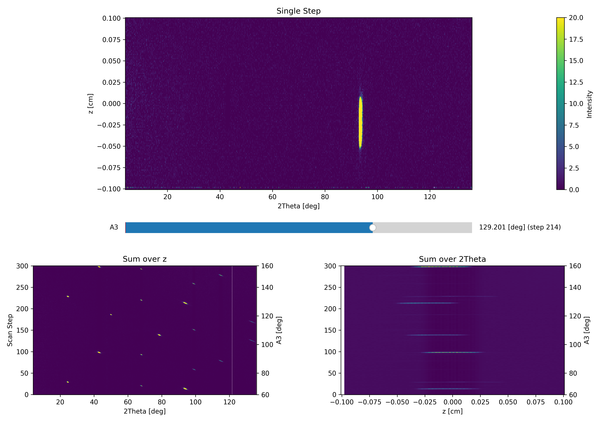

Interactive Viewer
^^^^^^^^^^^^^^^^^^
In a single crystal experiment, the first step is to gain an overview of the system. This is most often done by performing an A3 scan with the sample in a specific phase. Due to the 2D detector of DMC, such an A3 scan produces a 3D set of measured data points. In the frame of reference of the instrument, the majority of the covered volume is in the Qx-Qy plane, i.e. with Qz close to zero. A single A3 slices corresponds to a curved line in th Qx-Qy  together with a symmetrically curved line in Qz. This sheet is then rotated around the origin with each A3 step.The Interactive Viewer sums intensities in one direction to give 2D figures of measured intensities. In total 3 figures are then generated: summer over z, summed over A3 and summed over 2theta. The graphics are interactive and by clicking in the summed over z you change the A3. 

A useful feature is to use a defined A3 range to subtract background from a sample can. The given area is averaged and subtracted from the entire data set. This does not work well with A3-dependent powder rings and background subtracted data should not be used for cuts and integration. 

.. code-block:: python
   :linenos:

   from DMCpy import DataSet,DataFile,_tools
   import numpy as np
   import os
   
   # Give file number and folder the file is stored in.
   scanNumbers = '8540' 
   folder = 'data/SC'
   year = 2022
      
   # Create complete filepath
   file = os.path.join(os.getcwd(),_tools.fileListGenerator(scanNumbers,folder,year=year)[0]) 
   
   # Load data file with corrected twoTheta
   df = DataFile.loadDataFile(file)
   
   # run the Interactive Viewer
   IA1 = df.InteractiveViewer()
   IA1.set_clim(0,20)
   IA1.set_clim_zIntegrated(0,1000)
   
   IA1.fig.savefig('figure0.png',format='png')
   
   # Use above data file in data set. Must be inserted as a list
   ds = DataSet.DataSet([df])
   
   # subtract backround in a A3 range. This must be done on the dataSet level and act on every dataFile in the dataSet
   ds.subtractBkgRange(50,100)
   
   # run the Interactive Viewer
   IA2 = ds[0].InteractiveViewer()
   IA2.set_clim(0,20)
   IA2.set_clim_zIntegrated(0,1000)
   
   IA2.fig.savefig('figure1.png',format='png')
   
   # change index of A3
   IA2.plotSpectrum(index=114)
   
   IA2.fig.savefig('figure2.png',format='png')
   

The above code takes the data from the A3 scan file dmc2022n008540, and plot the Interactive Viewer. It also demonstrate how a A3 region (in step) can be subtracted to clean up the data. 

First data overview 

 

Second data overview with background subtraction

 

Third data overview with background subtraction and A3 step 114

 