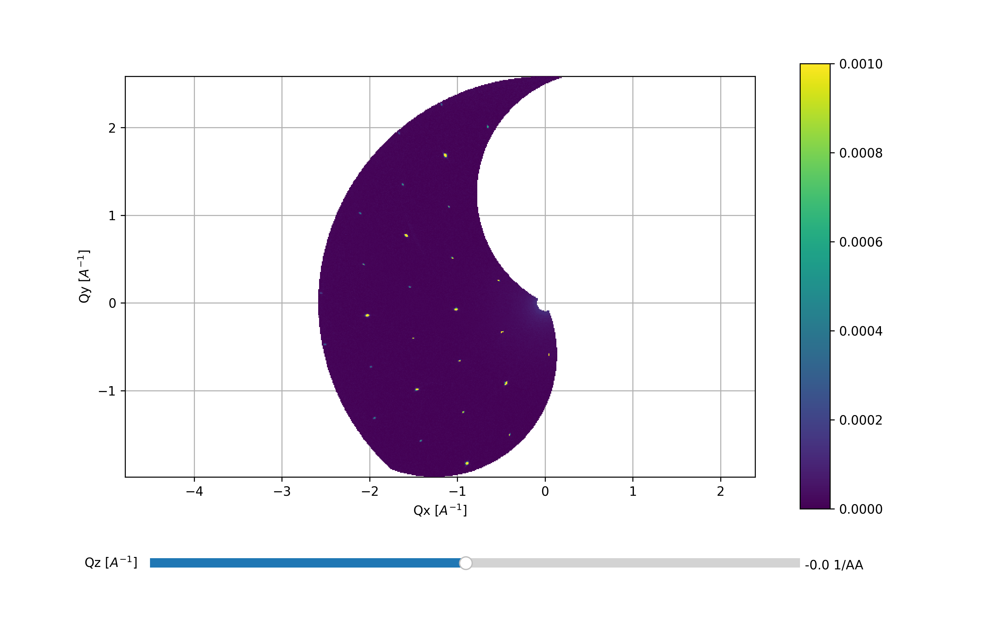
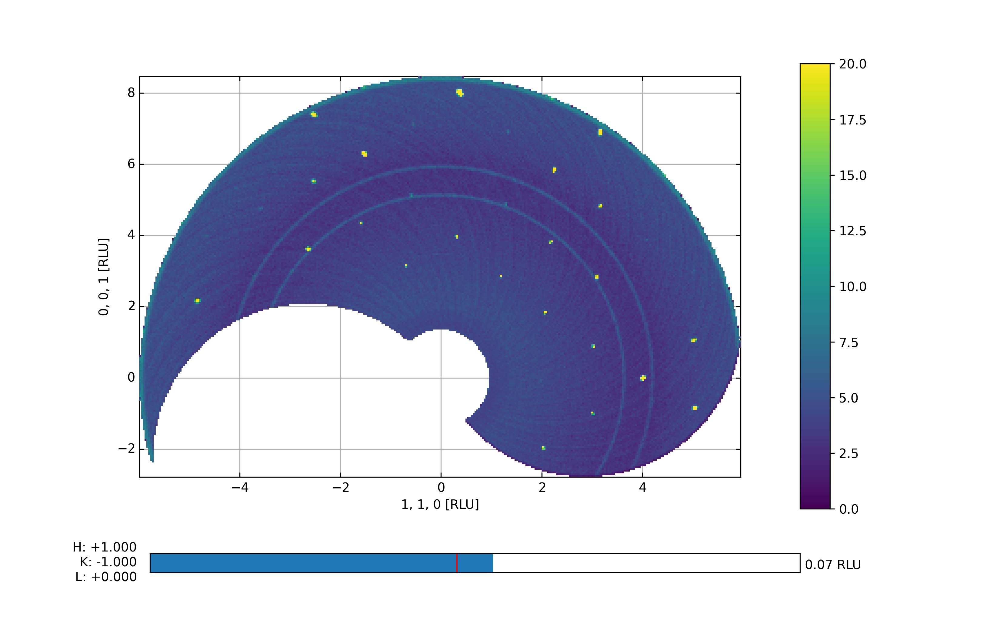
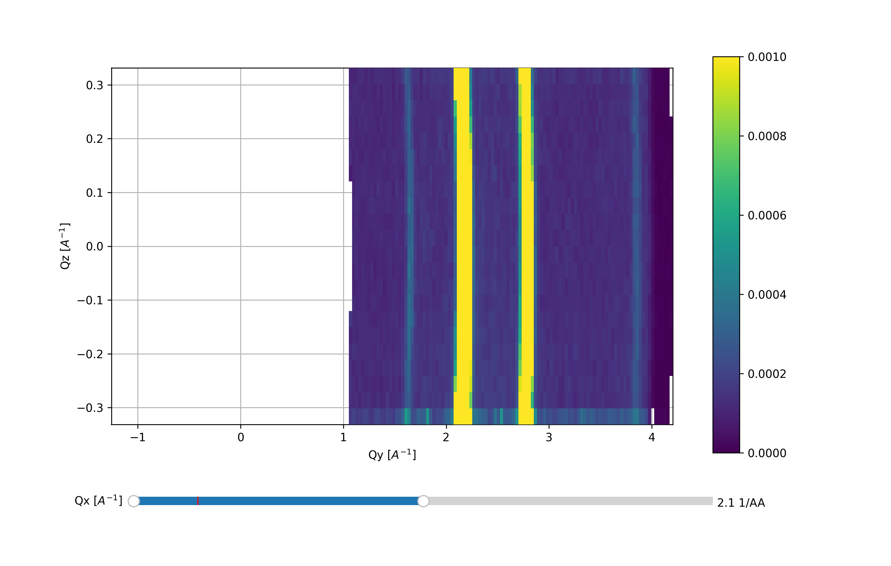

Viewer 3D
^^^^^^^^^
In a single crystal experiment, the first step is to gain an overview of the system. This is most often done by performing an A3 scan with the sample in a specific phase. Due to the 2D detector of DMC, such an A3 scan produces a 3D set of measured data points. In the frame of reference of the instrument, the majority of the covered volume is in the Qx-Qy plane, i.e. with Qz close to zero. A single A3 slices corresponds to a curved line in th Qx-Qy  together with a symmetrically curved line in Qz. This sheet is then rotated around the origin with each A3 step.

Interactivity
-------------
The Viewer 3D is an interactive plotting function which allows a look through the data in steps along the three major axes. In the current build, these are along Qx, Qy, and Qz, and once can change between them by clicking keys on the keyboard as tabulated below

+-----------------+------------------------------------------------------+ 
|    Key press    | Effect                                               | 
+-----------------+------------------------------------------------------+ 
|        0        | Change plotting such that Qx is constant             | 
+-----------------+------------------------------------------------------+ 
|        1        | Change plotting such that Qy is constant             | 
+-----------------+------------------------------------------------------+ 
|        2        | Change plotting such that Qz is constant             | 
+-----------------+------------------------------------------------------+ 
| \+ or UpArrow   | Increment step along constant axis                   | 
+-----------------+------------------------------------------------------+ 
|  Page Up        | Increment 10 steps along constant axis               | 
+-----------------+------------------------------------------------------+ 
|\- or DownArrow  | Decrement step along constant axis                   | 
+-----------------+------------------------------------------------------+ 
|  Page Down      | Decrement 10 steps along constant axis               | 
+-----------------+------------------------------------------------------+ 
|        s        | Save current figure                                  | 
+-----------------+------------------------------------------------------+ 
|       End       | Skip to the end of allowed stop in this projection   | 
+-----------------+------------------------------------------------------+ 
|       Home      | Skip to the start of allowed stop in this projection | 
+-----------------+------------------------------------------------------+ 

.. code-block:: python
   :linenos:

   from DMCpy import DataSet,DataFile,_tools
   import numpy as np
   import os
   
   # Give file number and folder the file is stored in.
   scanNumbers = '8540' 
   folder = 'data/SC'
   year = 2022
   
   # Create complete filepath
   file = os.path.join(os.getcwd(),_tools.fileListGenerator(scanNumbers,folder,year=year)[0]) 
   
   # Load data file with corrected twoTheta
   df = DataFile.loadDataFile(file)
   
   # Use above data file in data set. Must be inserted as a list
   ds = DataSet.DataSet([df])
   
   #ds.autoAlignScatteringPlane(scatteringNormal=np.array([0,0,1],dtype=float))
   
   Viewer = ds.Viewer3D(0.03,0.03,0.03,rlu=False)
   
   # Set the color bar limits to 0 and 0.001
   Viewer.set_clim(0,0.001)
   
   # Find the number of steps and set viewer to middel value
   # This can also be done interactively in the viewer by pressing up or down,
   # or by scrolling the mouse wheel or clicking the sliding bar.
   zSteps = Viewer.Z.shape[-1]
   Viewer.setPlane(int(zSteps/2)-1)
   
   fig = Viewer.ax.get_figure()
   fig.savefig('figure0.png',format='png')
   
   #  Change programatically to the next plane
   Viewer.setPlane(int(zSteps/2))
   fig2 = Viewer.ax.get_figure()
   fig2.savefig('figure1.png',format='png')
   
   
   # Instead of only stepping through the data with the Qx and Qy in the plane
   # one can flip the view by clicking 0, 1, or 2 in the interactive view,
   # or do it programmatically by
   
   Viewer.changeAxis(0)
   xSteps = Viewer.X.shape[-1]
   
   # Notice that the shape of X, Y, and Z changes when the axis is flipped! 
   # The last dimension is alway 'orthogonal' to the view.
   Viewer.setPlane(int(xSteps/2)-1)
   
   fig3 = Viewer.ax.get_figure()
   fig3.savefig('figure2.png',format='png')
   
   # data from 3D Viewer can be saved as a mat file. The generated files are large.
   if False:
   savedata = {'data':V.Data, 'bins':V.bins}
   savemat("matlab_matrix.mat", savedata)         
   

The above code takes the data from the A3 scan file dmc2021n008540 and generates the Viewer 3D utilizing a voxel size of 0.03 x 0.03 x 0.03 A:math:`^{-3}`. By default, the viewer starts out in projection 2, i.e. with Qz being the axis stepped through. When handling the data directly it is more convenient to utilize the keyboard shortcuts but in a scripting interface these are not available. Instead one can utilize the *.setPlane* and *.changeAxis* methods. In addition, the color scale has been tweaked such that weaker peaks are visible. It is possible to slightly tweak the color scale directly in the Viewer 3D by using the sliders to the right of the color bar. Notice: When saving the figure these slides are rendered invisible. The end results are shown below:

First data overview with Qz slightly positive and Qx and Qy in the plane

 

One step 'higher' up along Qz in the same scattering plane

 

Flipping of the scattering plane axis to 0, i.e. with Qx being constant

 