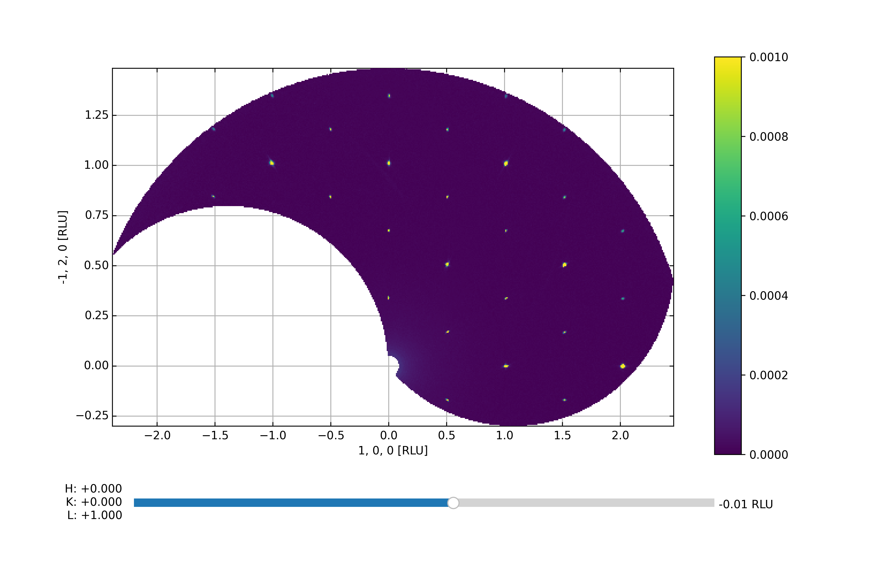
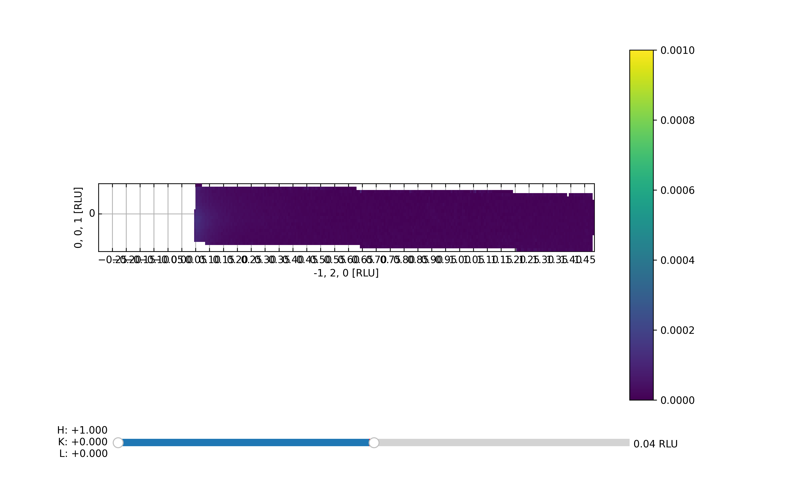

Viewer 3D align
^^^^^^^^^^^^^^^
To generate a UB matirx, it is convinient to use the 3D Viewer. We recommend to use the alignToRefs function. By running 3D Viewer with RLU=False, you can read of the coordinates of two reflections in Q-space. These coordinates and the corresponding HKL will then be used for making a UB. 

.. code-block:: python
   :linenos:

   from DMCpy import DataSet,DataFile,_tools
   import numpy as np
   import os
   
   # Give file number and folder the file is stored in.
   scanNumbers = '12153-12154' 
   folder = 'data/SC'
   year = 2022
  
   filePath = _tools.fileListGenerator(scanNumbers,folder,year=year) 
   
   # # # load dataFiles
   dataFiles = [DataFile.loadDataFile(dFP) for dFP in filePath]
         
   # load data files and make data set
   ds = DataSet.DataSet(dataFiles)
      
   # Define Q coordinates and HKL for the coordinates. 
   q1 = [-0.447,-0.914,-0.003]
   q2 = [-1.02,-0.067,-0.02]
   HKL1 = [1,0,0]
   HKL2 = [0,1,0]
   
   # this function uses two coordinates in Q space and align them to corrdinates in HKL space
   ds.alignToRefs(q1=q1,q2=q2,HKL1=HKL1,HKL2=HKL2)
   
   Viewer = ds.Viewer3D(0.01,0.01,0.02,rlu=True)
   
   # Set the color bar limits to 0 and 0.001
   Viewer.set_clim(0,0.001)
   
   # Find the number of steps and set viewer to middel value
   # This can also be done interactively in the viewer by pressing up or down,
   # or by scrolling the mouse wheel or clicking the sliding bar.
   zSteps = Viewer.Z.shape[-1]
   Viewer.setPlane(int(zSteps/2)-1)
   
   fig = Viewer.ax.get_figure()
   fig.savefig('figure0.png',format='png')
   
   #  Change programatically to the next plane
   Viewer.setPlane(int(zSteps/2))
   fig2 = Viewer.ax.get_figure()
   fig2.savefig('figure1.png',format='png')
   
   
   # Instead of only stepping through the data with the Qx and Qy in the plane
   # one can flip the view by clicking 0, 1, or 2 in the interactive view,
   # or do it programmatically by
   
   Viewer.changeAxis(0)
   xSteps = Viewer.X.shape[-1]
   
   # Notice that the shape of X, Y, and Z changes when the axis is flipped! 
   # The last dimension is alway 'orthogonal' to the view.
   Viewer.setPlane(int(xSteps/2)-1)
   
   fig3 = Viewer.ax.get_figure()
   fig3.savefig('figure2.png',format='png')
   

The above code takes the data from the A3 scan files 12153-12154 from 2022 and generates the Viewer 3D utilizing a voxel size of 0.01 x 0.01 x 0.01 in HKL-sapce. By default, the viewer starts out in projection 2, i.e. with Qz being the axis stepped through. When handling the data directly it is more convenient to utilize the keyboard shortcuts but in a scripting interface these are not available. Instead one can utilize the *.setPlane* and *.changeAxis* methods. In addition, the color scale has been tweaked such that weaker peaks are visible. It is possible to slightly tweak the color scale directly in the Viewer 3D by using the sliders to the right of the color bar. Notice: When saving the figure these slides are rendered invisible. The end results are shown below:

First data overview with Qz slightly positive and Qx and Qy in the plane

.. figure:: CenterMiddel_aligned.png 
  :width: 50%
  :align: center

 

One step 'higher' up along Qz in the same scattering plane

 

Flipping of the scattering plane axis to 0, i.e. with Qx being constant

 