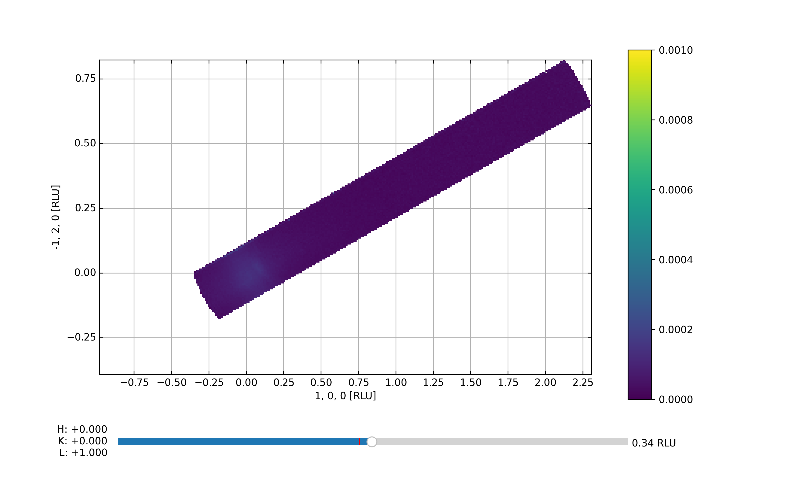
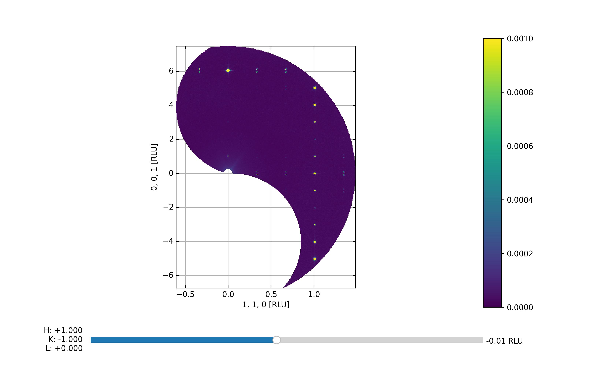

Viewer 3D align with new prjection vectors
^^^^^^^^^^^^^^^^^^^^^^^^^^^^^^^^^^^^^^^^^^
This tutorial illustrate that somethimes 3Dviewer can calculate different projector vectors than we prefer. This can be corrected by overwriting the projection vectors as done in the code below.

.. code-block:: python
   :linenos:

   from DMCpy import DataSet,DataFile,_tools
   import numpy as np
   
   # Give file number and folder the file is stored in.
   scanNumbers = '12105-12106' 
   folder = 'data/SC'
   year = 2022
  
   filePath = _tools.fileListGenerator(scanNumbers,folder,year=year) 
   
   unitCell = np.array([ 7.218, 7.218, 18.183, 90.0, 90.0, 120.0])
   
   # # # load dataFiles
   dataFiles = [DataFile.loadDataFile(dFP,unitCell = unitCell) for dFP in filePath]
         
   # load data files and make data set
   ds = DataSet.DataSet(dataFiles)
      
   # Define Q coordinates and HKL for the coordinates. 
   q2 = [-1.2240,-1.6901,-0.0175]
   q1 = [-1.4275,1.0299,-0.0055]
   HKL2 = [0,0,6]
   HKL1 = [1,1,0]
      
   # this function uses two coordinates in Q space and align them to corrdinates in HKL space
   ds.alignToRefs(q1=q1,q2=q2,HKL1=HKL1,HKL2=HKL2)
   
   Viewer = ds.Viewer3D(0.01,0.01,0.02,rlu=True)
   
   Viewer.set_clim(0,0.001)
   
   zSteps = Viewer.Z.shape[-1]
   Viewer.setPlane(int(zSteps/2)-1)
   
   fig = Viewer.ax.get_figure()
   fig.savefig('figure0.png',format='png')
   
   # we can enforce new projection vectors by this command:
   p1 = np.array([1,1,0])
   p2 = np.array([0,0,1])
   ds.setProjectionVectors(p1,p2,p3=None)
   
   Viewer2 = ds.Viewer3D(0.01,0.01,0.02,rlu=True)
   
   Viewer2.set_clim(0,0.001)
   
   zSteps = Viewer2.Z.shape[-1]
   Viewer2.setPlane(int(zSteps/2)-1)
   
   fig = Viewer2.ax.get_figure()
   fig.savefig('figure1.png',format='png')
   

The above code takes the data from the A3 scan files 12105-12106 from 2022 and generates the Viewer 3D utilizing a voxel size of 0.01 x 0.01 x 0.01 in Q-space. By default, the viewer starts out in projection 2, i.e. but the projection is strange. This is because 3Dviewer allways use 100, 010 or 001 as one of the projected axis. We can overwrite this and get 3Dviewer to plot what we want. 

3DViewer with default projection vectors

 

3DViewer with new projection vectors

 