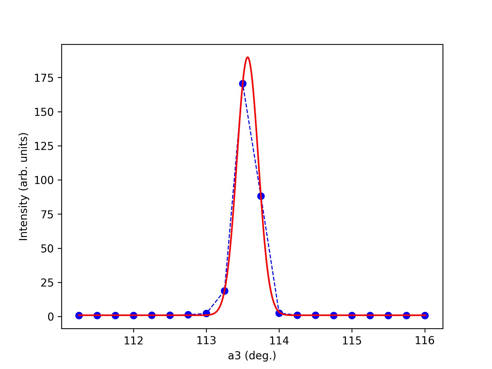
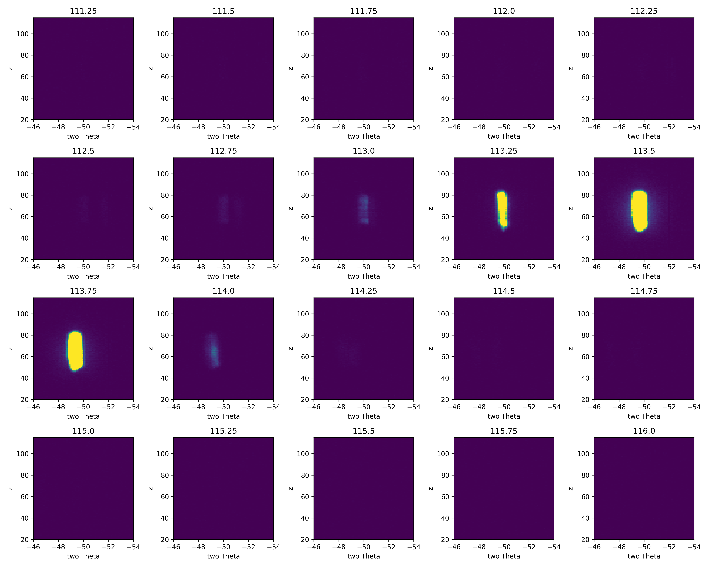

Box integration
^^^^^^^^^^^^^^^
This tutorial demonstrate a primitive method for integrating Bragg peaks from single crystals. Here, we define a range in A3 and 2Theta, and sum the intensities in the region. This means that the detector operates as a point detector. We can plot the integrated intensities and fit it with a Gaussian peak. 

.. code-block:: python
   :linenos:

   from DMCpy import DataSet,DataFile,_tools
   import numpy as np
   import os
   from scipy.optimize import curve_fit
   import matplotlib.pyplot as plt
   
   # Give file number and folder the file is stored in.
   scanNumbers = '8540' 
   folder = 'data/SC'
   year = 2022
      
   # Create complete filepath
   file = os.path.join(os.getcwd(),_tools.fileListGenerator(scanNumbers,folder,year=year)[0]) 
   
   df = DataFile.loadDataFile(file)
   
    # vertical range in pixcel
   startZ = 20
   stopZ = 115
   
   # # # twoTheta range
   startThetaVal = -46
   stopThetaVal = -54
   
   vmin = 0
   vmax = 0.05
   
   startTheta = np.argmin(np.abs(df.twoTheta[64]-startThetaVal))
   stopTheta = np.argmin(np.abs(df.twoTheta[64]-stopThetaVal))
   
   
   # # # A3 range
   startA3 = 245
   stopA3 = 265
   
   counts = df.intensity[startA3:stopA3,startZ:stopZ,startTheta:stopTheta].sum(axis=(1,2))/df.monitor[startA3:stopA3]
   
   # def Gaussian
   def gauss(x, H, A, x0, sigma):
      return H + A * np.exp(-(x - x0) ** 2 / (2 * sigma ** 2))
   
   def gauss_fit(x, y):
      mean = sum(x * y) / sum(y)
      sigma = np.sqrt(sum(y * (x - mean) ** 2) / sum(y))
      popt, pcov = curve_fit(gauss, x, y, p0=[min(y), max(y), mean, sigma])
      return popt
   
   
   xdata = df.A3[startA3:stopA3]
   ydata = counts
   
   H, A, x0, sigma = gauss_fit(xdata, ydata)
   FWHM = 2.35482 * sigma
   
   #Now calculate more points for the plot
   step = 0.01
   plotx = []
   ploty = []
   
   for value in np.arange(min(xdata),max(xdata)+step,step):
      plotx.append(value)
      ploty.append(gauss(value, H, A, x0, sigma))
   
   fig,ax = plt.subplots()
   ax.plot(xdata, ydata, 'bo--', linewidth=1, markersize=6,label='data')
   ax.plot(plotx, ploty, 'r', label='fit')
   plt.xlabel('a3 (deg.)')
   plt.ylabel('Intensity (arb. units)')
   
   fig.savefig('figure0.png',format='png')
   
   # integrated intensity of peak
   integrated = H + np.sqrt(2*np.pi) * np.abs(sigma)
   
   print('The offset of the gaussian baseline is', H)
   print('The center of the gaussian fit is', x0)
   print('The sigma of the gaussian fit is', sigma)
   print('The maximum intensity of the gaussian fit is', H + A)
   print('The Amplitude of the gaussian fit is', A)
   print('The FWHM of the gaussian fit is', FWHM)
   print('The integrated intensity is',integrated)
   ################################################
   
   total = len(df.A3[startA3:stopA3])
   rows = int(np.floor(np.sqrt(total)))
   cols = int(np.ceil(np.sqrt(total)))
   
   fig,Ax = plt.subplots(nrows=rows,ncols=cols,figsize=(15,12))
   Ax = Ax.flatten()
   II = []
   
   for a3,c,ax in zip(df.A3[startA3:stopA3], df.counts[startA3:stopA3,startZ:stopZ,startTheta:stopTheta]/df.monitor[startA3:stopA3].reshape(-1,1,1),Ax):
      II.append(ax.imshow(c,origin='lower',extent=(startThetaVal,stopThetaVal,startZ,stopZ),vmin=vmin,vmax=vmax))
      ax.set_xlabel('two Theta')
      ax.set_ylabel('z')
      ax.set_title(str(a3))
      ax.axis('auto')
   
   
   fig.tight_layout()
   
   for i in II:
      i.set_clim(vmin,vmax)
   
   fig.savefig('figure1.png',format='png')
   

The above code takes the data from the A3 scan file dmc2022n008540, and select and area in A3 and pixels. It then sums the detector in the given pixel area and extract the intensity as a function of A3. 

Intensity as a function of A3 

 

Visualization of the pixel area of the detector used 

 