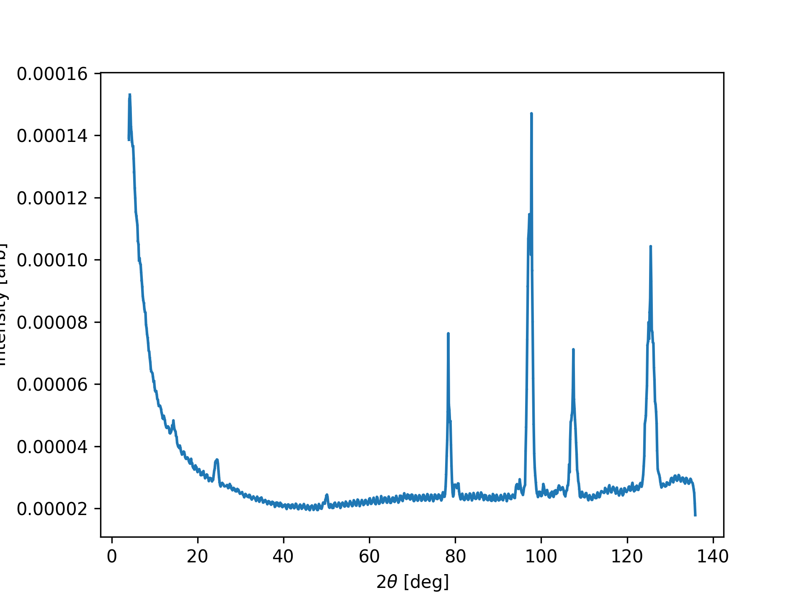

Force powder
^^^^^^^^^^^^
This tutorial demonstrate how a single crystal dataset can be converted to a powder dataset and plotted and exported. 

.. code-block:: python
   :linenos:

   from DMCpy import DataSet,DataFile,_tools
   import matplotlib.pyplot as plt
   import numpy as np
   
   # Give file number and folder the file is stored in.
   scanNumbers = '12105-12106' 
   folder = 'data/SC'
   year = 2022
  
   filePath = _tools.fileListGenerator(scanNumbers,folder,year=year) 
         
   # load data files and make data set
   ds = DataSet.DataSet(filePath,forcePowder=True)
   
   ax,bins,Int,Int_err,monitor = ds.plotTwoTheta()
   planeFigName = 'docs/Tutorials/forecePowder'
   plt.savefig('figure0.png',format='png')
   
   # Export to an dat and xye file
   ds.export_PSI_format(outFile='force_powder.Dat',outFolder='docs/Tutorials')
   ds.export_xye_format(outFile='force_powder.xye',outFolder='docs/Tutorials')
   

The above code takes a single crystal data file and converts it into a powder file. This means that all A3 are merged. Note that we do not load the datafiles first into DataFiles, but they are loaded directly into a DataSet. 

Diffraction pattern from single crystal data. 

 