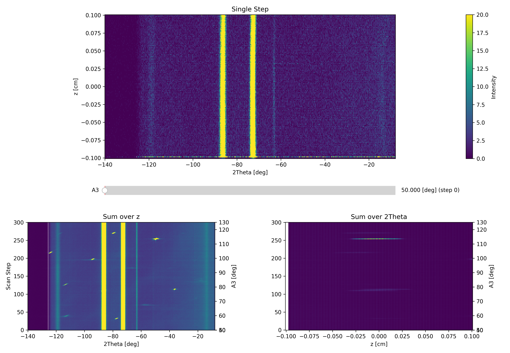
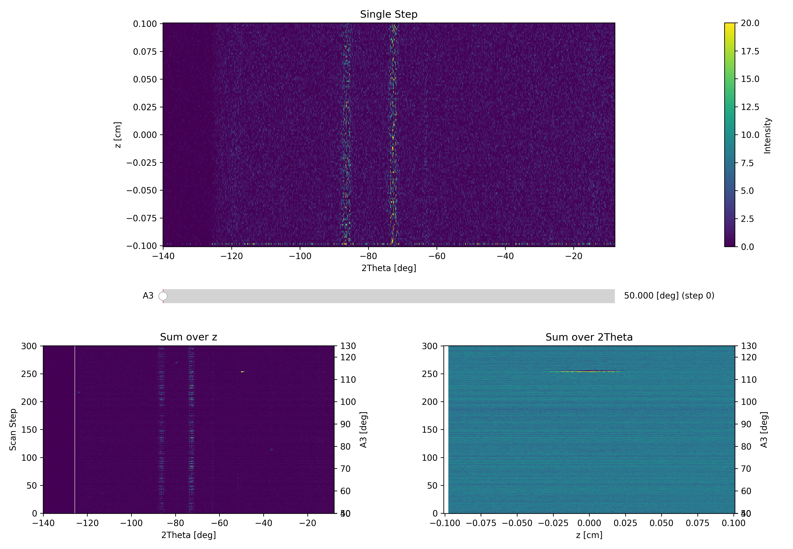
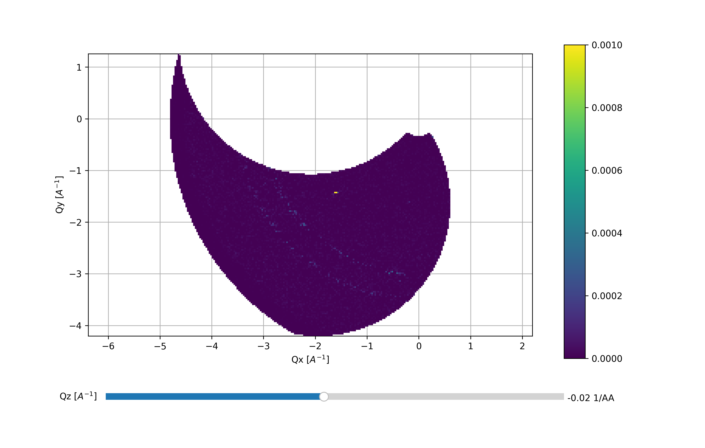
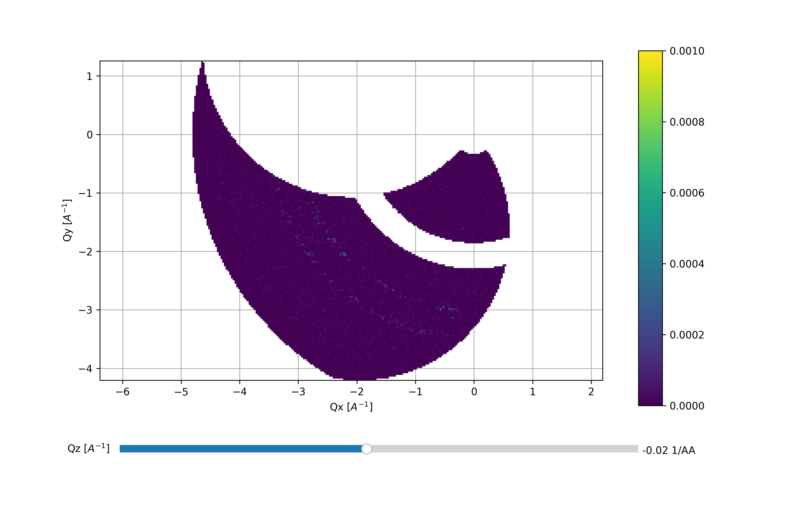

Subtracting data sets
^^^^^^^^^^^^^^^^^^^^^
It can be very useful to subtract two data sets from each other, e.g. to look for diffuse magnetic scattering. In DMCpy, two data sets with the same A3 can be subtracted from each other. An example of a code is below. The subtraction is perfomed on the DataSet and 3DViewer, plotQPlane, and plotCut1D can be used on the subtracted data. 

.. code-block:: python
   :linenos:

   from DMCpy import DataSet,DataFile,_tools
   import os
   
   # Give file number and folder the file is stored in.
   scanNumbers = '8540' 
   folder = 'data/SC'
   year = 2022
      
   # Create complete filepath
   file = os.path.join(os.getcwd(),_tools.fileListGenerator(scanNumbers,folder,year=year)[0]) 
   
   # Load data file with corrected twoTheta
   df = DataFile.loadDataFile(file)
   
   # run the Interactive Viewer
   IA1 = df.InteractiveViewer()
   IA1.set_clim(0,20)
   IA1.set_clim_zIntegrated(0,1000)
   
   IA1.fig.savefig('figure0.png',format='png')
   
   # Use above data file in data set. Must be inserted as a list
   ds = DataSet.DataSet([df])
   
   # # # subtract dataSets
   if True:
      files_sub = '8553'
      filePath_sub =  os.path.join(os.getcwd(),_tools.fileListGenerator(files_sub,folder,year=year)[0]) 
      
      dataFiles_sub = DataFile.loadDataFile(filePath_sub)
      ds_sub = DataSet.DataSet(dataFiles_sub)
      
      # we can choose if we write the subtracted data into the original data file or if we make a new file.
      ds.directSubtractDS(ds_sub,saveToFile=True,saveToNewFile='subtracted_data.hdf')
   
      #saveToFile (bool): If True, save background to data file, else save in RAM (default False)
      #saveToNewFile (string) If provided, and saveToFile is True, save a new file with the background subtraction (default False)
   
   # run the Interactive Viewer
   IA2 = df.InteractiveViewer()
   IA2.set_clim(0,20)
   IA2.set_clim_zIntegrated(0,1000)
   
   IA2.fig.savefig('figure1.png',format='png')   
   
   Viewer = ds.Viewer3D(0.03,0.03,0.03,rlu=False)
   Viewer.set_clim(0,0.001)
   zSteps = Viewer.Z.shape[-1]
   Viewer.setPlane(int(zSteps/2)-1)
   Viewer.ax.axis('equal')
   
   fig = Viewer.ax.get_figure()
   fig.savefig('figure2.png',format='png')   
   
   # # # mask data
   if True:
      for df in ds:
         df.mask[:,:,300:400] = True
   
   Viewer2 = ds.Viewer3D(0.03,0.03,0.03,rlu=False)
   Viewer2.set_clim(0,0.001)
   Viewer2.setPlane(int(zSteps/2)-1)
   Viewer2.ax.axis('equal')
   
   fig2 = Viewer2.ax.get_figure()
   fig2.savefig('figure3.png',format='png')        
   

The above code takes the data from the A3 scan file dmc2022n008540 and subtracts dmc2022n008553. The files are meaured under identical conditions and we expect a good subtraction.  We see in both interactive Viewer and 3DViewer that we have good subtractoin, but the Cu rings from the sample can is still visible together with some intensity on the 111-reflection. 

First data overview 

 

Second data overview with background subtraction and A3 step 114

 

Third data overview with background subtraction and A3 step 114

 

Fourth data overview with a mask between detector pixcel 300 and 400 

 